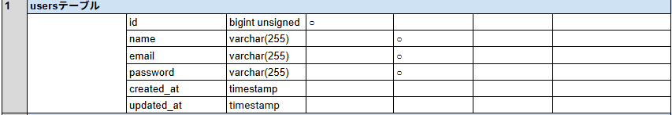
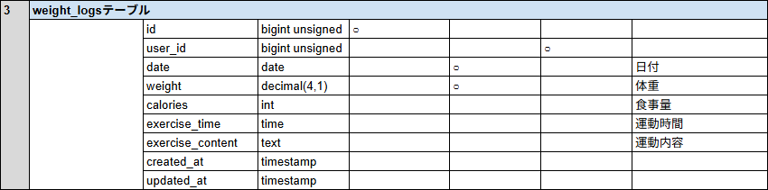
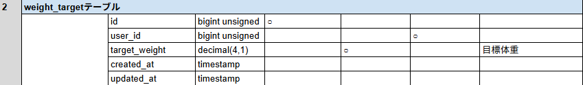
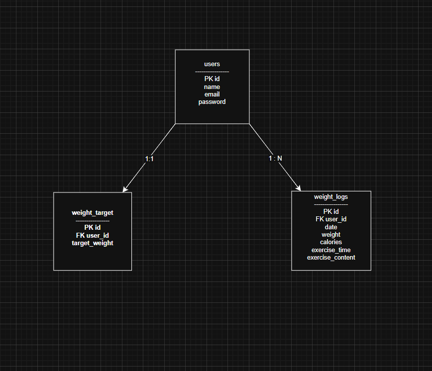

# PiGLy（体重管理アプリ）

## 環境構築

### Docker ビルド

1. リポジトリをクローン

```bash
git clone git@github.com:yutaka-fujise/test3.git
```

2.プロジェクトディレクトリへ移動
cd pigly

3.DockerDesktop アプリを起動
4.Docker コンテナをビルド・起動
docker-compose up -d --build

※Mac の M1・M2 チップの PC の場合
no matching manifest for linux/arm64/v8 in the manifest list entries
のエラーが表示され、ビルドできない場合があります。
その際は docker-compose.yml の mysql サービスに
以下の記述を追加してください。
mysql:
platform: linux/x86_64
image: mysql:8.0.26

Laravel 環境構築

1.PHP コンテナに入る
docker-compose exec php bash 2.パッケージをインストール
composer install 3. .env ファイルを作成
cp .env.example .env 4. .env に以下の環境変数を追加
DB_CONNECTION=mysql
DB_HOST=mysql
DB_PORT=3306
DB_DATABASE=laravel_db
DB_USERNAME=laravel_user
DB_PASSWORD=laravel_pass 5.アプリケーションキーの作成
php artisan key:generate 6.マイグレーションの実行
php artisan migrate 7.シーディングの実行
php artisan db:seed 8.シンボリックリンク作成
php artisan storage:link

使用技術（実行環境）
・PHP 8.x
・Laravel 8.x
・MySQL 8.0
・Docker / Docker Compose

機能一覧
・ユーザー登録・ログイン（Laravel Fortify）
・体重・摂取カロリー・運動時間・運動内容の登録
・登録データの編集・削除
・体重ログの一覧表示
・日付による検索機能
・目標体重の設定・更新
・目標体重までの差分表示
・ログアウト機能

テーブル設計




ER 図


URL
・開発環境：http://localhost/
・phpMyAdmin：http://localhost:8080/

補足
・認証機能には Laravel Fortify を使用しています。
・ログアウト処理は POST /logout にて実装し、・セッションを破棄後ログイン画面へ遷移します。
・Docker 環境下での再現性を重視した構成としています。
